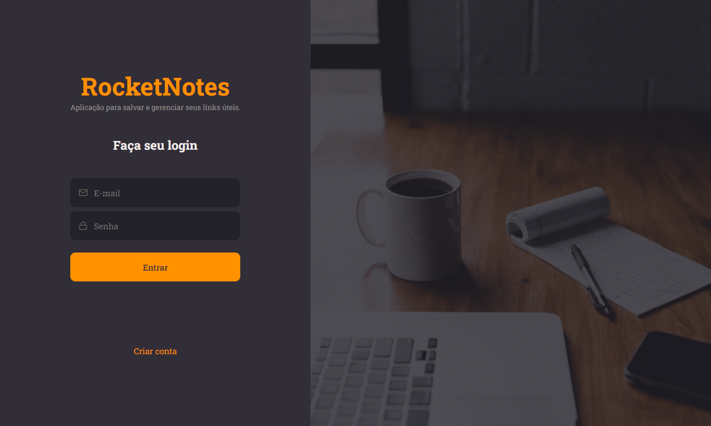
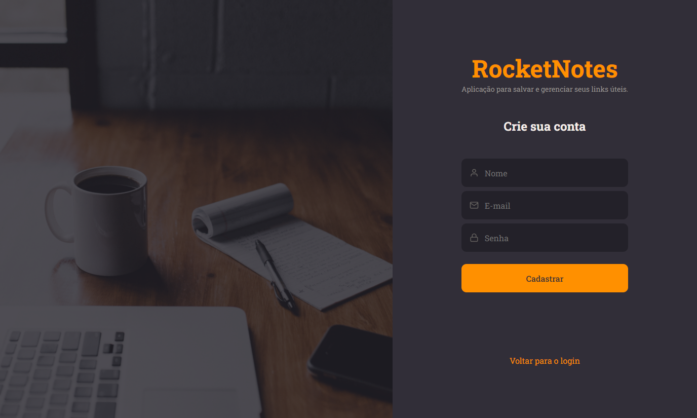
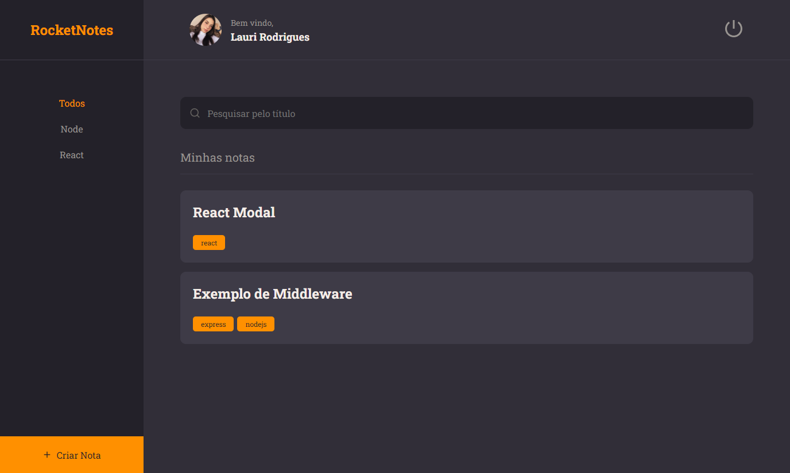
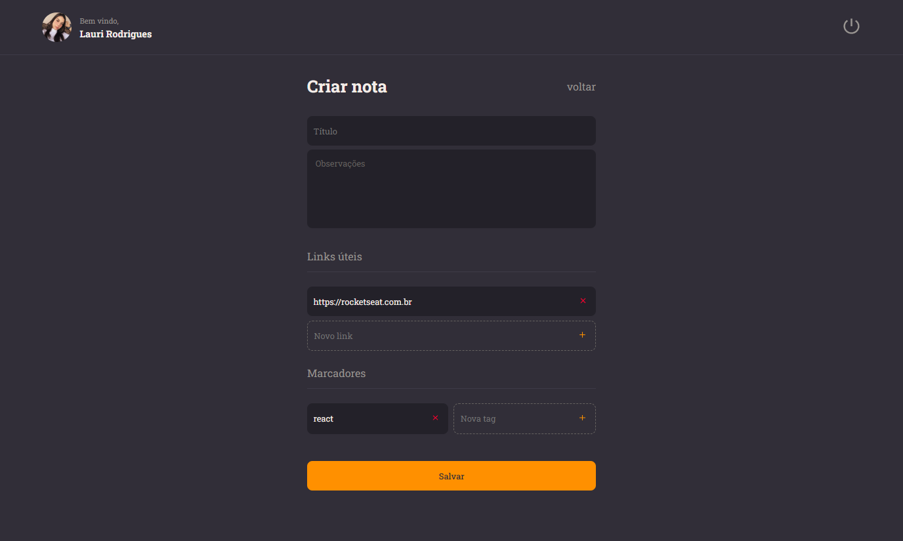
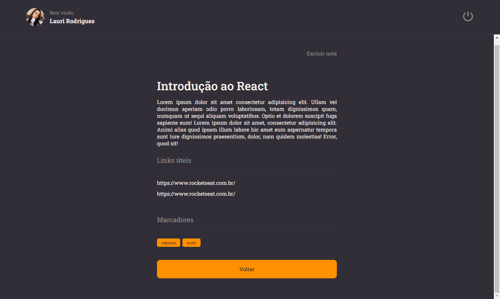
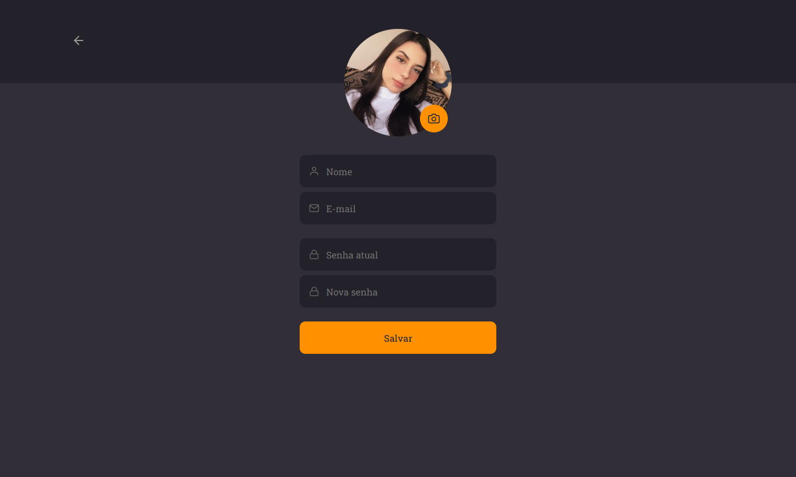

  

	
<h4 align="center"> 
	🚀 Projeto 18 | Stage 09 - RocketNotes -FrontEnd
</h4>

  

<h2 align=left> 💻 Sobre o projeto </h3>

 Projeto realizado durante o programa <strong>Explorer</strong> da <a href="https://www.rocketseat.com.br/"> <strong>Rocketseat</strong> </a>. É o décimo oitavo projeto do programa, localizado no nível 9, onde construímos uma aplicação de cadastro de notas utilizando React.

  
<h2 align=left> 🛠 Tecnologias utilizadas </h3>

  
  
  

<h2 align=left> 🎨 Layout </h2>

